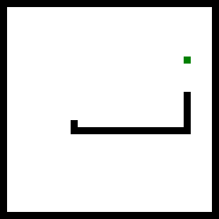

# Worksheet for Strange Loop workshop

## Code for this workshop

https://github.com/maryrosecook/strange-loop

## The itinerary

1. I'll livecode Space Invaders from scratch.
2. We'll briefly dissect the architectural approach I used.
3. You'll choose what game to implement: Snake, Asteroids, Lunar Lander.
4. You'll spend the rest of the workshop implementing your game.  I'll
be here to troubleshoot and give advice.

## The aims of this workshop

Every game has different, low-level problems that need to be solved.
The solutions to these problems are different for different games.
If this workshop were about how to do animation, or player movement,
or collision resolution, it would not be very useful.  The techniques
I presented would be useful for one game, but not others.

This workshop is based around letting you practice using an
architectural approach that is good for building 2D action games.
This approach can be applied to many different games.  It scales to
ten, a hundred or a thousand times as many lines of code.

This workshop will also let you complete, or make good progress on,
your first game.

## Space Invaders

The code is in `space-invaders/space-invaders.js`.

## The game architecture

The `template-game/game.js` file contains the architecture
with all the actual game-specific code stripped out.  This is
a good reference point for your game.

This architecture is not set in stone.  Feel free to deviate
from it if your game requires it.

## Host (run) a JS game

### Install Python 2

### Run

To serve the Space Invaders code

    $ cd strange-loop/
    $ python -m SimpleHTTPServer 4000
    $ open space-invaders/index.html

## Performance profiling

* Open dev tools in Chrome.

* Go to the Profiles tab.

* Click Collect JavaScript CPU Profile.

* Run your game.

* Click the grey circle below the magnifying glass on the left.

* Let the game run for a bit.

* Click the grey circle again.

* Click on Profile 1 on the left.

* Note the percentages of CPU time and function names near the top of the
the Self column.

* Make those functions more efficient!

## What game to make?

### Snake

Reasonably simple.  Probably the best example for focusing on the
architecture and not getting bogged down in implementation details.

### Asteroids

Requries some trigonometry to detect when lines are intersecting.

### Lunar Lander

Requires some trigonometry to detect when lines are intersecting.  Also fiddly
because the lander has to be able to rest on the landing pad.

## How to get started

1. Get a black square drawing on the canvas.

2. Create a game tick function and get it running many times a second.

3. In the tick function, update increment the position of the black square to make it move acrosse the screen.

4. Create a player body and get its update() and draw() functions running.

5. Use the keyboard to move the player around.

6. ...

## Canvas drawing reference

See `canvas-drawing-reference.md` in the root of this repo.
