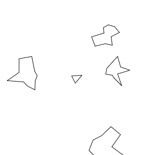

# Worksheet for Strange Loop workshop

## Mary livecodes Space Invaders

The code is in `space-invaders/space-invaders.js`.

## Host a JS game

To serve the Space Invaders code

    $ cd strange-loop/
    $ python -m SimpleHTTPServer 4000
    $ open space-invaders/index.html

## Performance profiling

* Open dev tools in Chrome.

* Go to the Profiles tab.

* Click Collect JavaScript CPU Profile.

* Run your game.

* Click the grey circle below the magnifying glass on the left.

* Let the game run for a bit.

* Click the grey circle again.

* Click on Profile 1 on the left.

* Note the percentages of CPU time and function names near the top of the
the Self column.

* Make those functions more efficient!

## An architecture for simple games in code

The `template-game/game.js` file contains the architecture
with all the actual game-specific code stripped out.  This file
might be a good starting point for your game.

## What game to make?

### Snake

Reasonably simple.  Probably the best example for focusing on the
architecture above and not getting bogged down in implementation details.

### Asteroids

Requries some trigonometry to detect when lines are intersecting.

### Lunar Lander

Requires some trigonometry to detect when lines are intersecting.  Also fiddly
because the lander has to be able to rest on the landing pad.

## How to get started

1. Get a black square drawing on the canvas.

2. Create a game tick function and get it running many times a second.

3. In the tick function, update increment the position of the black square to make it move acrosse the screen.

4. Create a player body and get its update() and draw() functions running.

5. Use the keyboard to move the player around.

6. ...
